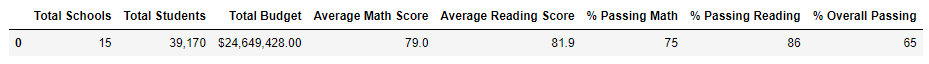

# PyCitySchools with Pandas

## Overview of the school district analysis

Upon completing the original school district analysis on student_complete.csv and school_complete.csv, evidence of academic dishonesty was discovered on reading and math grades from Thomas High School ninth grade class. District required new analysis after replacing the Thomas High School ninth grade reading and math scores with NaNs

## Results

### How is the district summary affected?

District Summary - Original

District Summary - Updated
#### The removal of the Thomas High School ninth grade reading and math score reduced the overall average and passing percentages of the district.

____________________________________________________________

### How is the school summary affected?

School Summary - Original

School Summary - Updated
#### The removal of the Thomas High School ninth grade reading and math scores had no impact on the other school scores. Thomas High School has a overall reduction in their own math, reading and overall passing percentages.

____________________________________________________________

### How does replacing the ninth graders’ math and reading scores affect Thomas High School’s performance relative to the other schools?

Thomas High School including ninth grade scores

Thomas High School removing ninth grade scores

#### Analysis was conducted to remove the ninth grade scores and recalculate the scores for Thomas High School with only 10th, 11th, and 12th grade scores. The removal of the ninth grade scores placed Thomas High School back into the top performing schools in the district. The removal of the Thomas High School ninth grade reading and math scores improved the overall performance of the school.

____________________________________________________________

### How does replacing the ninth-grade scores affect the following:

math scores

reading scores

#### Replacing the Thomas High School ninth grade scores returns NaNs for Thomas High School ninth grade data.

____________________________________________________________
#### Scores by school spending: 

Spending Summary - Original

Spending Summary - Updated

#### No noticeable change in school spending when Thomas High School ninth grade data is omitted from the analysis.

____________________________________________________________
#### Scores by school size:

Size Summary - Original

Size Summary - Updated

#### No noticeable change in school spending when Thomas High School ninth grade data is omitted from the analysis.

____________________________________________________________
#### Scores by school type:

Type Summary - Original

Type Summary - Updated

#### No noticeable change in school spending when Thomas High School ninth grade data is omitted from the analysis.

## Summary

### Summarize four changes in the updated school district analysis after reading and math scores for the ninth grade at Thomas High School have been replaced with NaNs:

Thomas High School - Original

Thomas High School - Updated

Thomas High School - ONLY 10th, 11th, and 12th Grade

#### - The Thomas High School passing percentages were reduced when ninth grade reading and math scores were replaced with NaNs.
#### - This would have changed the passing percentages for the district had this data been included in the reamaining analysis.
#### - The request to complete the analysis with only Thomas High School 10th, 11th, and 12th grade scores returned the scores to near original levels.
#### - By omitting the NaN scores from the analysis and only using Thomas High School 10th, 11th, and 12th grade scores, the district analysis for spending, population, and school type is virtually unchanged from the original analysis.
#### - A recommendation to perform the remaining analysis with the NaN data will present a more accurate picture of the effect the academic dishonest can have on the entire district. 
